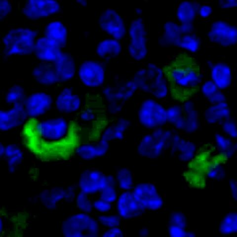

# 用于医学图像分割的U2Net

本项目基于 U2Net 实现医学图像分割，内置轻量级的[通道注意力机制](https://arxiv.org/abs/1709.01507)，用于分析癌细胞的扩散情况，并统计癌细胞在所有细胞（癌细胞与健康细胞）中的比例。该项目可用于辅助癌症检测、病理分析和治疗效果评估，帮助医生优化治疗决策。

## 环境要求

- **Python**: 3.6 / 3.7 / 3.8
- **System**: Windows（不支持多 GPU 训练）/ Ubuntu / CentOS
- **Dependencies**: `numpy`: 1.22.0，`torch`: 1.10.0，`torchvision`: 0.11.1，`opencv_python`: 4.5.4.60

## 数据集介绍

### 1. [MedCell](https://pan.baidu.com/s/1UbOIvaXYqIuKF4H60u3Rjg?pwd=u5r4) 数据集

<p align="left">
  
  
</p>

每张图片中，绿色区域代表癌细胞，蓝色区域代表健康细胞。

### 2. 数据集格式

数据集格式与 [DUTS-TR](http://saliencydetection.net/duts/) 一致，结构如下：

```
data
├── DUTS-TR
│   ├── DUTS-TR-Image       # 训练集
│   └── DUTS-TR-Mask        # 训练集 GT 标签
│
└── DUTS-TE
    ├── DUTS-TE-Image       # 验证集
    └── DUTS-TE-Mask        # 验证集 GT 标签
```

## 使用说明

1. **加载预训练权重**：点击[此处](https://pan.baidu.com/s/14yZTXzMcuXhrxICEGs8zXQ?pwd=kdyq)下载，并将其放入 `src` 文件夹中。
2. **单 GPU 或 CPU 训练**: 直接使用 `train.py` 脚本进行训练。
3. **多 GPU 训练**: 使用以下指令进行训练：
   ```bash
   torchrun --nproc_per_node=8 train_multi_GPU.py
   ```
   其中，`nproc_per_node` 参数为使用的 GPU 数量。
4. **预测**: 使用 `predict.py` 脚本进行预测。
5. **统计**: 使用 `count.py` 脚本统计癌细胞在所有细胞中的比例。
